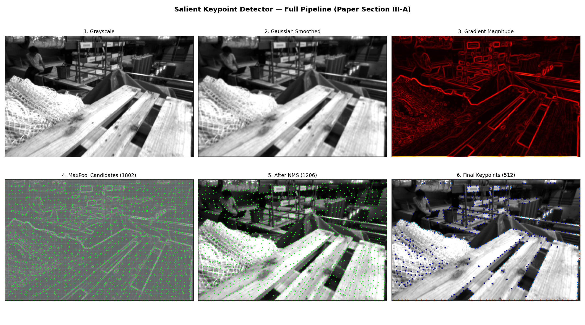
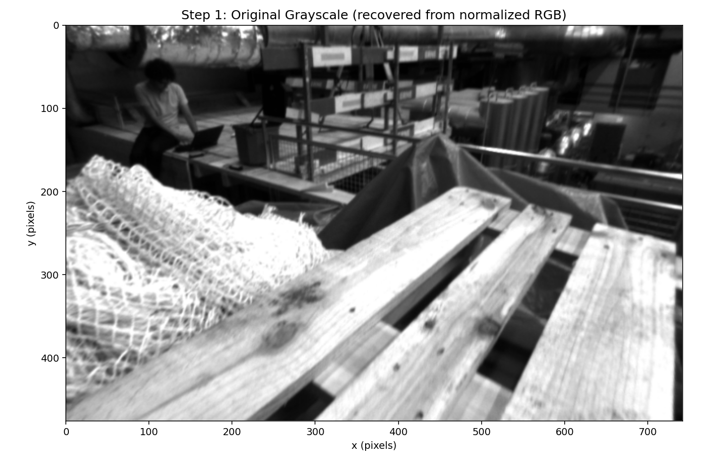
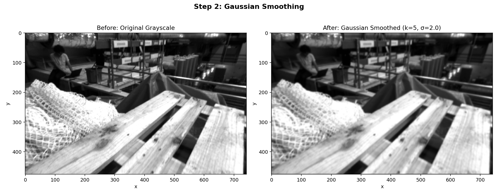
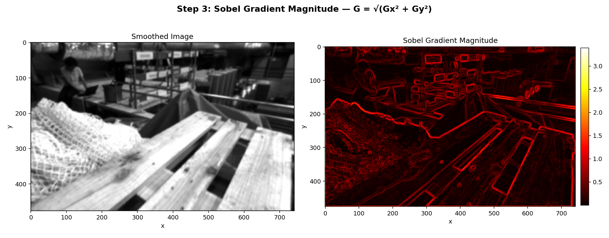
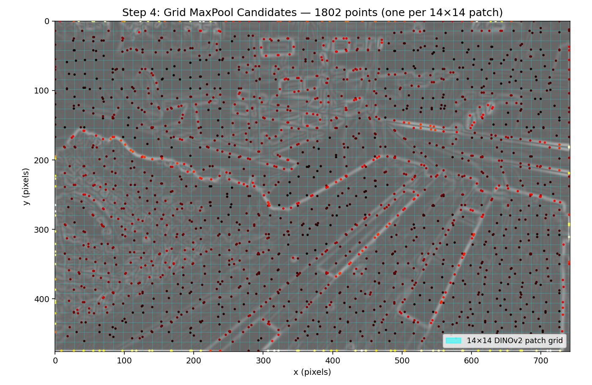
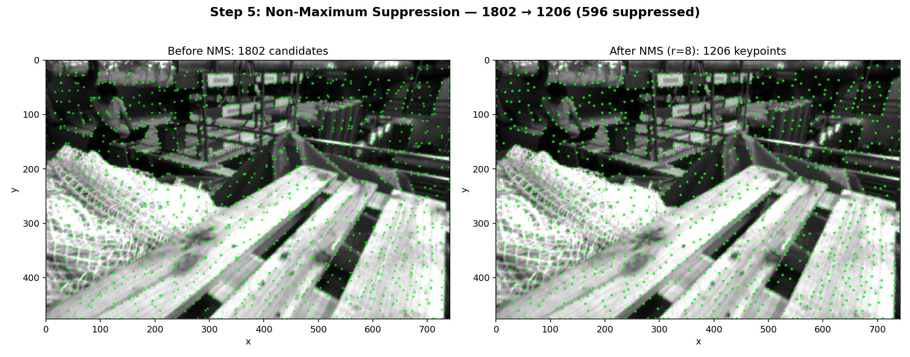
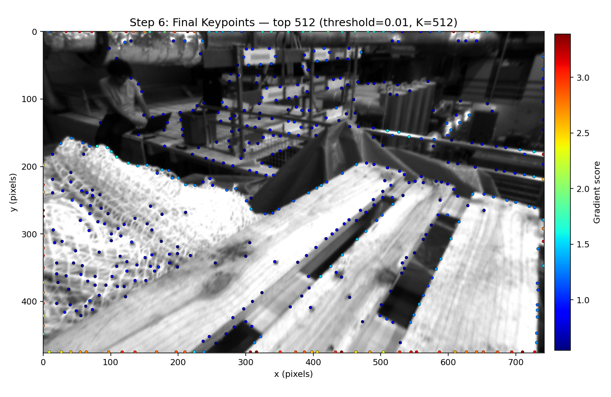

# Salient Keypoint Detector — DINO-VO

**Paper Reference:** Section III-A, "Salient Keypoint Detector"

---

## What Is It?

The Salient Keypoint Detector selects **512 interest points** per image that are likely to be reliably matched across consecutive frames. Instead of using learned keypoint detectors (like SuperPoint), DINO-VO uses a classical gradient-based approach that is fast, deterministic, and aligned with DINOv2's patch grid.

---

## Why Does It Exist?

DINO-VO needs sparse correspondences between two frames to estimate camera motion. Rather than matching every pixel (expensive), we select a small set of keypoints that:

1. **Have strong gradients** — edges and corners are easier to match
2. **Are well-distributed** — spread across the image for robust pose estimation
3. **Align to the DINOv2 patch grid** — each 14x14 patch produces one feature vector, so keypoints should align to these patches for clean feature extraction

---

## Where It Fits in the DINO-VO Pipeline

```
                        DINO-VO Pipeline
                        ================

  Image_t  ──┬──> [Salient Keypoint Detector] ──> 512 keypoints (x,y)
             │              ▼
             ├──> [DINOv2 ViT-S] ──────────────> patch features (384-dim)
             │              ▼
             ├──> [FinerCNN] ──────────────────> fine features (64-dim)
             │              ▼
             │   [Feature Fusion] ─────────────> descriptors (192-dim)
             │              ▼
  Image_t+1 ─┘   [Feature Matching] ──────────> correspondences + weights
                            ▼
                  [Pose Estimation] ──────────> relative pose (R, t)
```

The keypoint detector is the **first module** in the pipeline. Its output (pixel coordinates) is used by:
- **Feature Descriptor** (Phase 4) — extracts DINOv2 + FinerCNN features at keypoint locations
- **Feature Matching** (Phase 5) — matches keypoints between the two images
- **Pose Estimation** (Phase 6) — uses matched keypoints to compute Essential matrix

---

## Pipeline Overview

The full detector pipeline on a real EuRoC MH01 frame:



---

## How It Works (Step by Step)

### Step 1: Grayscale Recovery

The EuRoC dataloader outputs ImageNet-normalized 3-channel tensors. Since the original images are grayscale (repeated to 3 channels), we reverse the normalization on channel 0 to recover the grayscale image in [0, 1].

```
I_gray = image[:, 0:1] * std_ch0 + mean_ch0
```



---

### Step 2: Gaussian Smoothing

Apply a Gaussian filter to reduce noise before gradient computation.

- **Kernel size:** 5x5
- **Standard deviation:** 2.0
- **Implementation:** `torch.nn.functional.conv2d` with a pre-built Gaussian kernel (registered as a buffer)

```
I_smooth = GaussianFilter(I_gray, kernel=5, sigma=2.0)
```

The smoothing suppresses sensor noise while preserving strong edges — compare the original (left) with the smoothed result (right):



---

### Step 3: Sobel Gradient Magnitude

Compute image gradients in x and y directions using Sobel operators, then compute the gradient magnitude.

```
G_x = Sobel_x(I_smooth)
G_y = Sobel_y(I_smooth)
G = sqrt(G_x² + G_y²)
```

This produces a gradient magnitude map where edges and corners have high values (bright = strong gradient):



---

### Step 4: Grid-Based MaxPooling

Pool the gradient magnitude into a grid that matches DINOv2's patch size. DINOv2-ViT-S uses 14x14 patches, so we apply MaxPool with:

- **Kernel size:** 14x14
- **Stride:** 14

This produces a coarse grid where each cell contributes **one candidate keypoint** — the pixel with the highest gradient in that patch. For a 476x742 image:
- Output size: 34x53 = **1,802 candidates**

```
G_pooled = MaxPool2d(G, kernel_size=14, stride=14)  # shape: (34, 53)
```

The cyan grid shows the 14x14 DINOv2 patches. Each colored dot is the max-gradient pixel within its patch:



---

### Step 5: Non-Maximum Suppression (NMS)

Apply NMS with a radius to suppress keypoints that are too close together. This is processed greedily — the highest-scoring keypoint survives and suppresses all neighbors within the radius.

- **NMS radius:** r_NMS = 8 pixels

NMS reduces 1,802 candidates to **1,206** (596 suppressed):



---

### Step 6: Gradient Thresholding + Top-K Selection

Two final filters:
1. **Gradient threshold** (0.01) — removes keypoints in textureless regions
2. **Top-K selection** (K=512) — keeps the 512 highest-scoring keypoints

If fewer than 512 keypoints pass the threshold, all surviving keypoints are kept (padded with zeros).

The final 512 keypoints are well-distributed, concentrated on edges/corners, and colored by gradient score (red = strongest):



---

## Hyperparameters Summary

| Parameter | Value | Rationale |
|-----------|-------|-----------|
| Gaussian kernel | 5x5 | Standard smoothing before gradients |
| Gaussian sigma | 2.0 | Moderate smoothing |
| MaxPool kernel | 14x14 | Matches DINOv2 ViT-S patch size |
| MaxPool stride | 14 | Non-overlapping patches |
| NMS radius | 8 pixels | Prevents keypoint clustering |
| Gradient threshold | 0.01 | Removes textureless regions |
| Top-K | 512 | Balance between coverage and compute |

---

## Expected Input / Output

**Input:**
- ImageNet-normalized RGB tensor, shape `(B, 3, 476, 742)`
- (Grayscale is recovered internally by reversing normalization)

**Output:**
- `keypoints`: `(B, 512, 2)` — (x, y) pixel coordinates
- `scores`: `(B, 512)` — gradient magnitude at each keypoint
- `num_valid`: `(B,)` — number of valid keypoints per image
- `gradient_map`: `(B, 1, H, W)` — full gradient magnitude map

---

## Verification Criteria

After implementation, verify:
1. Exactly 512 keypoints are output per image (or fewer if thresholding removes too many)
2. Keypoints are distributed across the image (not clustered in one region)
3. Keypoints tend to fall on edges and corners (high gradient areas)
4. Keypoints roughly align to the 14x14 DINOv2 patch grid
5. No keypoints appear within r_NMS=8 pixels of each other

---

## Connection to Other Modules

| Module | Interaction |
|--------|-------------|
| **transforms.py** | Provides preprocessed images; keypoint detector reverses normalization internally |
| **feature_descriptor.py** | Takes keypoint coordinates → samples DINOv2 and FinerCNN features at those locations |
| **feature_matching.py** | Receives keypoints + descriptors from both frames → produces correspondences |
| **losses.py** | Matching loss supervises correspondence quality; pose loss supervises estimated motion |

---

## Implementation Notes

- The detector is **not learned** — it uses fixed Gaussian/Sobel filters, no trainable parameters
- It accepts ImageNet-normalized 3-channel tensors and recovers grayscale internally
- All operations are implemented as **torch operations** running on GPU
- The detector processes both frames of a pair independently

---

## Regenerating Visualizations

To regenerate the step-by-step visualizations from a real EuRoC frame:

```bash
python scripts/visualize_keypoint_steps.py
```

Output is saved to `outputs/keypoint_steps/`.
